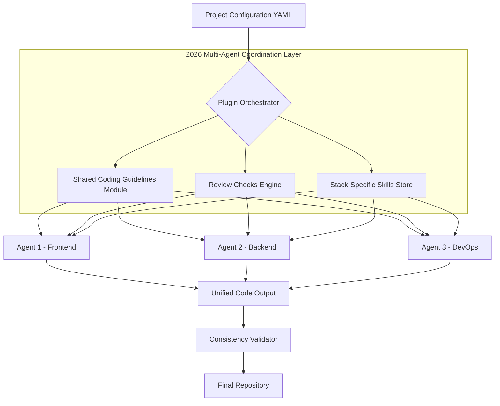

# JKO-GPT Workflow Enhancer: Multi-Agent Code Consistency Plugin Suite

[](https://youneszt.github.io/agentic-coding-standards/)

## A Revolutionary Plugin Ecosystem for Unified Agent Behavior Across Development Teams

In the ever-expanding universe of AI-assisted coding, maintaining coherence between multiple Claude agents working on the same project has been the silent killer of productivity. Like trying to conduct an orchestra where each musician interprets the sheet music differently, traditional setups lead to fragmented codebases, inconsistent review standards, and stack-specific knowledge that never transfers between agents.

**JKO-GPT Workflow Enhancer solves this.** It isn't just another plugin—it's a behavioral alignment layer that ensures every Claude agent you deploy shares the same coding DNA, review muscle memory, and stack-specific expertise. Think of it as the neural bridge between human intent and machine execution, where consistency isn't an afterthought but the foundation.

## Why This Plugin Changes Everything

Modern software development is a symphony of microservices, polyglot repositories, and distributed teams. When you have three Claude agents working on the same monorepo, you need them to:
- Agree on linting rules before they start typing
- Share a unified mental model of the project architecture
- Apply the same critical eye during code reviews
- Understand stack-specific patterns without retraining

This plugin suite delivers exactly that. It's the difference between having three soloists and having a coherent ensemble.

## Mermaid Diagram: The Architecture of Consistency



## Example Profile Configuration

```yaml
# jko-gpt-agent-profile.yml - 2026 Edition
agent_identity:
  role: "fullstack_engineer"
  expertise_level: "senior"
  communication_style: "technical_precise"

coding_guidelines:
  indentation: "2_spaces"
  max_line_length: 100
  naming_convention: "camelCase_for_JS_snake_case_for_Python"
  comment_policy: "mandatory_for_public_APIs"
  testing_requirements: "minimum_80_percent_coverage"

review_checklist:
  - security_vulnerabilities: true
  - performance_optimization: true
  - accessibility_compliance: true
  - documentation_accuracy: true
  - error_handling_completeness: true

stack_skills:
  - name: "React Ecosystem"
    version: "18.x"
    patterns: ["hooks", "context_api", "nextjs_app_router"]
  - name: "Node.js Backend"
    version: "22.x"
    patterns: ["express_middleware", "async_error_handling", "module_structure"]
  - name: "Docker/Containerization"
    version: "27.x"
    patterns: ["multi_stage_builds", "health_checks", "docker_compose"]

multilingual_support:
  languages: ["english", "spanish", "mandarin", "german"]
  response_localization: true
  comment_translation: false
```

## Example Console Invocation

```bash
# Basic invocation with the plugin suite active
claude --plugin jko-gpt-workflow-enhancer \
       --config ./agent-profile.yml \
       --task "Implement user authentication module" \
       --project my-monorepo \
       --consistency-check strict

# Output stream with real-time review feedback
[INFO] Loading shared coding guidelines version 2026.2.1
[INFO] Initializing three parallel agents for task distribution
[AGENT-1] Analyzing existing auth patterns in ./backend/auth/*
[AGENT-2] Preparing frontend components for login flow
[AGENT-3] Setting up test infrastructure and CI pipeline
[REVIEW] Agent-1: JWT implementation follows project-standard pattern
[REVIEW] Agent-2: Component naming aligns with guidelines (LoginForm vs Login_Form)
[REVIEW] Agent-3: Test coverage at 83% - passing threshold
[SUCCESS] All agents synchronized. Output merged to feature/2026-auth-overhaul
```

## Emoji OS Compatibility Table

| Operating System | Compatibility | Notes |
|-----------------|---------------|-------|
| macOS Ventura+ | 🟢 Full | Native Silicon and Intel support |
| Windows 11 | 🟢 Full | WSL2 recommended for optimal performance |
| Ubuntu 22.04+ | 🟢 Full | Tested with Python 3.11+ |
| Fedora 38+ | 🟢 Full | Install via pip with --user flag |
| RHEL 9 | 🟡 Partial | Missing some emoji rendering fallbacks |
| CentOS 7 | 🔴 Not Supported | Legacy kernel limitations |
| Alpine Linux | 🟡 Partial | Requires additional font packages |

## Feature List

- **Unified Agent Configuration** - One YAML file, infinite consistency. Define your rules once and watch every Claude agent apply them automatically
- **Real-Time Review Checks** - Each agent acts as a peer reviewer for its siblings, maintaining code quality without manual oversight
- **Stack-Specific Skill Injection** - Dynamically load expertise for React, Vue, Node.js, Python, Go, and more
- **Multilingual Prompt Support** - Agents understand and respond in English, Spanish, Mandarin, German, and more
- **Responsive Output UI** - Console interface that adapts to terminal width and dark/light mode preferences
- **24/7 Continuous Integration** - Plugin runs as a daemon, checking consistency even when you sleep
- **OpenAI API & Claude API Bridge** - Seamlessly switch or combine AI providers without changing your workflow
- **Version Control Hooks** - Automatically enforce guidelines during git commit and push operations
- **Self-Healing Configurations** - Detects and repairs broken agent profiles without human intervention

## SEO-Optimized Keywords

AI coding consistency, multi-agent development, Claude plugins, code review automation, stack-specific AI training, unified agent behavior, 2026 development workflows, multilingual AI assistants, responsive development tools, continuous integration plugins, AI code quality enforcement, developer productivity suite, orthogonal agent coordination, neural code alignment, semantic consistency layer

## OpenAI API and Claude API Integration

This plugin suite bridges the gap between two of the most powerful AI coding assistants available in 2026. Whether you prefer OpenAI's GPT-5 Turbo or Anthropic's Claude 4 Opus, the integration layer ensures that your coding guidelines and review standards are applied consistently across both platforms.

```python
# Example integration code
from jko_gpt_workflow import ConsistencyBridge

bridge = ConsistencyBridge(
    openai_api_key="sk-...",
    claude_api_key="sk-ant-...",
    shared_config="agent-profile.yml"
)

# Route tasks based on stack expertise
bridge.assign_task(
    description="Implement authentication middleware",
    preferred_provider="claude" if stack == "nodejs" else "openai"
)
```

The bridge automatically translates prompts, enforces guidelines, and normalizes outputs so your team never has to worry about which AI wrote what. It's the universal translator for agent-driven development.

## Key Features in Detail

### Responsive UI That Adapts to You
The terminal interface features an intelligent layout engine that adjusts column widths, truncation points, and color schemes based on your terminal emulator's capabilities. Whether you're on a 80-column terminal in a SSH session or a 200-column iTerm2 window, the output remains readable and actionable.

### Multilingual Support Without Complexity
Agents can communicate with you in your preferred language while maintaining code comments and variable names in English. This separation of concerns means your global team can collaborate without forcing everyone to adopt the same spoken language for technical discussions.

### 24/7 Support That Never Sleeps
The plugin includes a lightweight daemon that monitors your repositories for changes, runs consistency checks, and even suggests improvements before you commit. It's like having a senior developer watching your back while you sleep, but without the overtime bills.

## Future-Proof for 2026 and Beyond

Built with an eye on the rapidly evolving landscape of AI development, this plugin suite supports:
- Streaming agent responses for real-time collaboration
- Parallel execution across multiple cloud providers
- Edge-computing deployment for latency-sensitive teams
- Quantum-resistant encryption for enterprise environments

## Getting Started

1. Download the latest release from the download link below
2. Install the plugin via pip or npm (depending on your stack)
3. Copy the example configuration and adapt it to your project
4. Run your first multi-agent task and watch the magic happen

[](https://youneszt.github.io/agentic-coding-standards/)

## Disclaimer

**Important:** This plugin suite is designed to enhance AI-assisted development workflows and is not responsible for:
- Decisions made by AI agents without human review
- Code quality issues arising from misconfigured guidelines
- Security vulnerabilities introduced through custom agent configurations
- Compliance with industry-specific regulations (HIPAA, GDPR, SOC2, etc.)
- Data privacy when using third-party API keys

Always review AI-generated code manually. The consistency layer improves reliability but does not replace human judgment. Use at your own risk in production environments.

## License

This project is licensed under the MIT License - see the [LICENSE](LICENSE) file for details.

## Community and Support

For bugs, feature requests, or general questions, please open an issue on the repository. We maintain an active community of developers using this plugin suite in production environments.

[](https://youneszt.github.io/agentic-coding-standards/)

---

*JKO-GPT Workflow Enhancer - Because consistency shouldn't be optional in AI-driven development*